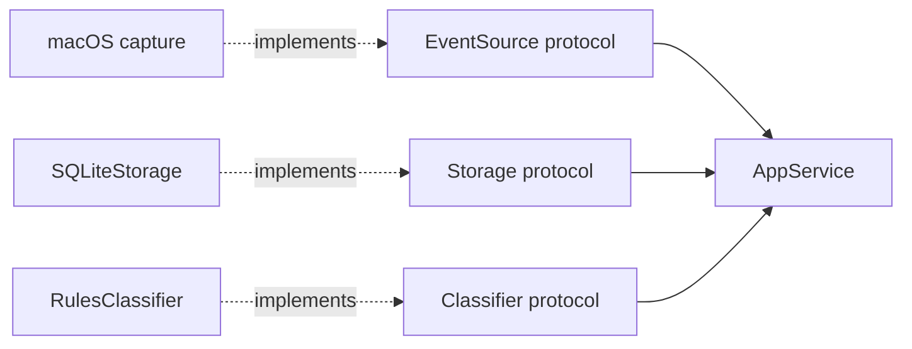

# Refactored App Architecture

## Overview

The refactored activity logger separates capture, orchestration, classification,
and persistence. The core works with small protocol interfaces, while concrete
platform and infrastructure code lives in packages around it.

The current backend runs end to end on macOS:

```text
macOS foreground capture
        |
        v
    AppService
      |     |
      v     v
   SQLite  rules classifier
```

`new_backend.py` creates these components and starts the capture loop. The
dashboard and sync/export paths still use the older stack and have not yet been
migrated.


## Current Components

### Core

`new_core` contains the application-facing types and contracts:

- `models.py` defines `Event` and `Classification`.
- `ports.py` defines the `EventSource`, `Storage`, `Classifier`, `Publisher`,
  and `AppOverride` protocols.
- `appservice.py` validates finalized events, persists them, optionally runs
  classification, stores classifier output, and handles user overrides.

The core only depends on the Python standard library and its own modules. It
does not know how macOS capture, SQLite, browser integration, or a dashboard is
implemented.

### Capture

`new_logger` contains the platform-specific event sources and their helpers:

- `macos/macos_front_app_source.py` captures foreground applications and emits
  completed time segments.
- `macos/macos_idle.py` detects idle periods.
- `macos/app_overrides.py` reads enhanced Firefox title and URL metadata.
- `sanitization/url_sanitizer.py` removes sensitive URL data before an event is
  emitted.

The source owns segmentation. When the foreground state changes, it emits a
finalized `Event` with both `start_ts` and `end_ts`; `AppService` does not keep
open database rows.

### Storage

`new_storage/sqlite.py` provides `SQLiteStorage`, the concrete implementation
of the core `Storage` protocol. It creates and manages three tables:

```text
events
engine_classifications
user_overrides
```

Raw events, derived classifier results, and user changes are stored separately.
This keeps the captured data intact and allows events to be reclassified later.
The effective label is resolved with this precedence:

```text
user override > engine classification
```

SQLite runs in WAL mode, so an active or recently opened database may have
`-wal` and `-shm` companion files. Runtime databases under `data/` are ignored
by Git.

### Classification

`new_classifiers/rules.py` provides `RulesClassifier`, the concrete
implementation of the core `Classifier` protocol. It loads
`config/category_rules.json` and classifies events using this order:

1. Idle event
2. Exact application match
3. Exact hostname and most-specific path-prefix match
4. `Unknown`

Results are stored with the engine version `rules-v1`. This makes classifier
output replaceable without modifying raw events.

### Runtime

`new_backend.py` is the composition root for the refactored backend. It wires
together:

```text
MacOSFrontAppSourceAdaptive
    -> AppService
        -> SQLiteStorage
        -> RulesClassifier
        -> NoopPublisher
```

By default, data is written to `data/activity.sqlite3`. A different database
path can be supplied with `--db`, and immediate classification can be disabled
with `--no-classify`.

```bash
python new_backend.py
python new_backend.py --db /path/to/activity.sqlite3
python new_backend.py --no-classify
```

The backend closes the source and database connection during a normal shutdown.


## Event and Label Flow

### Ingestion

```text
1. The macOS source detects a foreground-state change.
2. It emits the completed segment as an Event.
3. AppService validates the timestamps.
4. SQLiteStorage inserts the raw event.
5. RulesClassifier produces a Classification.
6. SQLiteStorage stores the versioned classification.
7. Publisher callbacks announce the changes.
```

Classification errors do not stop event capture. `AppService` preserves the raw
event and continues processing later segments.

### User overrides

```text
1. A UI or API calls AppService.set_override(...).
2. SQLiteStorage inserts or updates the user override.
3. AppService notifies the Publisher.
```

`clear_override(...)` removes the user-authored label and returns the event to
its engine-generated classification.


## Dependency Boundaries

Dependencies point inward toward the core protocols:



Code in `new_core` must not import platform APIs, SQLite implementation details,
Dash, browser bridges, sync providers, or classifier-specific logic. Concrete
adapters may import the core models and protocols.

The main responsibilities are:

| Layer | Owns | Does not own |
| --- | --- | --- |
| Capture | platform polling, metadata, idle detection, segmentation | persistence and classification |
| Core | contracts, validation, orchestration, override commands | platform and database details |
| Storage | tables, transactions, persisted records | capture, matching rules, UI behavior |
| Classifier | mapping an event to a versioned label | event capture and persistence |
| UI/API | queries, display, user commands | capture and classification rules |


## Repository Layout

```text
new_backend.py                    backend entry point
new_core/
  models.py                      domain types
  ports.py                       protocol boundaries
  appservice.py                  ingestion and override orchestration
new_logger/
  macos/                         macOS capture and browser metadata
  sanitization/                  URL privacy handling
new_storage/
  sqlite.py                      SQLite storage implementation
new_classifiers/
  rules.py                       deterministic rules classifier
new_tests/
  unit/                          core, storage, classifier, sanitizer tests
  integration/macos/             macOS capture integration tests
```


## Remaining Work

The refactored capture backend is functional, but it does not yet replace the
whole application. The next pieces are:

- a read/query layer for events and effective labels;
- dashboard integration using that query layer and `AppService` override
  methods;
- a non-noop publisher if the dashboard needs live updates;
- migration of export and sync behavior from the old stack;
- a Windows `EventSource` implementation;
- production logging and metrics around capture and classification failures.

Parquet can remain an export or reporting format rather than the primary write
path. Additional classifiers, such as an AI fallback or a composite classifier,
can be added behind the existing `Classifier` protocol when needed.


## Tests

The refactored unit tests cover application orchestration, SQLite persistence,
rules classification, and URL sanitization. macOS capture has a separate
integration test suite.

```bash
PYTHONPATH=. pytest -c new_tests/pytest.ini new_tests/unit
PYTHONPATH=. pytest -c new_tests/pytest.ini new_tests/integration/macos
```
